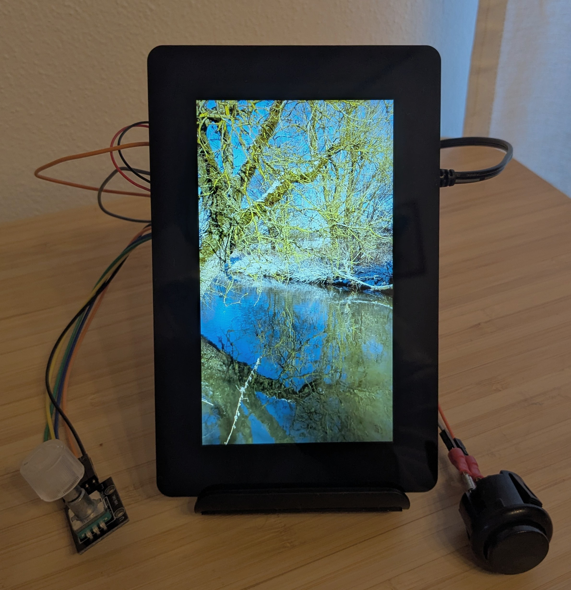

# pi-video-looper



Simple video looper for Raspberry Pi 1 B+ driving the Raspberry Pi Display 2. It plays a folder of videos on repeat, lets you switch clips with a button press, adjust screen brightness with a rotary encoder, and power off with an encoder press. It also supports videos sorted in subdirectories letting you switch between the subdirectories with a double button press. A systemd service starts the python script automatically after boot.

## Table of contents
- [Hardware](#hardware)
	- [Wiring (BCM pin numbers)](#wiring-bcm-pin-numbers)
	- [Display](#display)
- [Software](#software)
    - [Install on the Pi](#install-on-the-pi)
    - [Allow passwordless poweroff](#allow-passwordless-poweroff)
    - [Optional GPU memory tweaks](#optional-gpu-memory-tweaks)
    - [Media preparation](#media-preparation)
    - [Automatic video encoding](#automatic-video-encoding)
    - [How it works](#how-it-works)
- [Why H.264 and hardware acceleration](#why-h264-and-hardware-acceleration)
- [Controls](#controls)
- [Future work](#future-work)
- [Service management](#service-management)

## Hardware
- Raspberry Pi 1 B+
- Raspberry Pi Display 2 (720x1280)
- KY-040 rotary encoder (brightness control + power button)
- Mini arcade button AB24OL-S (next/previous video)
- Jumper/Dupont cables for wiring power, ground, and the GPIO pins listed below

### Wiring (BCM pin numbers)
- Encoder A: GPIO 23
- Encoder B: GPIO 24
- Encoder button: GPIO 27 (press to power off)
- Arcade button: GPIO 17 (short press = next video, long press ≥1s = previous video, double press = change subdirectory)
- Common grounds to Pi GND; encoder VCC to 3.3V

### Display
- The Raspberry Pi Display 2 connects over the Pi's DSI ribbon cable, so it is essentially plug-and-play—attach the ribbon and power leads, and the stock Pi OS kernel brings the panel up without extra drivers.

## Software
- Raspberry Pi OS Lite on the SD card
- Network or console access to the Pi
- `git` installed (`sudo apt-get update && sudo apt-get install -y git`)

### Install on the Pi
```bash
git clone https://github.com/<your-user>/pi-video-looper.git
cd pi-video-looper
chmod +x deploy.sh
./deploy.sh
```

What deploy does:
- Installs GStreamer and gpiozero dependencies
- Copies `looper.py` to `/usr/local/bin/looper.py`
- Installs systemd unit `looper.service` and enables/starts it

### Allow passwordless poweroff
`looper.py` calls `sudo poweroff` when you press the encoder button. To let it shut down cleanly without prompting for a password, add this sudoers rule:

```bash
sudo visudo
# Then add (replace <user> with your login):
<user> ALL=(ALL) NOPASSWD: /usr/sbin/poweroff
```

Using `visudo` ensures the syntax is checked before saving so you do not accidentally break sudo access.

### Optional GPU memory tweaks
For smoother decoding on the Pi 1 B+, you can reserve a bit more RAM for VideoCore and its contiguous CMA heap. Edit `/boot/firmware/config.txt` and add:

```ini
gpu_mem=128
cma=512
```

These values increase the GPU framebuffer budget and the contiguous memory allocator used by the video pipeline. The stock settings often work fine, so only change them if you see "out of memory" or display glitches. Remember to reboot after editing `config.txt`.

### Media preparation
- Videos are read from `/media/videos`. Create and permission that directory so the service can read the media even when running as root:

```bash
sudo mkdir -p /media/videos
sudo chown "$USER:$USER" /media/videos   # or chown to a shared media group
sudo chmod 775 /media/videos
```

Those two chmod/chown steps make the mount writable for everyday SSH/SCP transfers while still letting the `looper.service` process (running as root) read the files. Adjust the owner or group if you share the directory with other users.

- Within `/media/videos` you can create subdirectories to categories videos, e.g. winter or summer
- Supported extensions: mp4, mkv, mov (see `looper.py`).
- Encode your videos as H.264

### Automatic video encoding
- Preferably run this on a faster host PC, then copy the outputs to the Pi, as this is rather compute intensive
- Use case: batch-convert source clips to Pi-friendly H.264 and pre-build ~30-minute looped outputs
- I am using 30 min looped videos, as the Pi has a black screen for about 2 seconds every time it loops a video, as it empties the video pipeline and reloads it. Therefore I am having this effect only every 30 minutes and can use this as a timer.
- The script uses `ffmpeg` and `ffprobe`.
- What it does:
    - Creates/uses `videos/converted_pi/` as the output folder.
    - Encodes each `mp4/mov/mkv/avi` (case-insensitive) to H.264/AAC once (`*_pi.mp4`) with `libx264` (profile high, level 4.0, CRF 23) and `movflags + faststart` for fast starts.
    - Reads the encoded duration and concatenates the file enough times to reach about 30 minutes (`*_pi_30min.mp4`, target 1800s).
    - Skips files already converted to 30 minutes, reuses existing single-encode intermediates, and removes intermediates after the final concat to save space.
- After that you can `scp` the videos in `/media/videos` or in categorized subdirectories `media/videos/..`
- Adjustments: tweak `TARGET_SECONDS` or `OUTPUT_DIR` at the top of `videos/convert_for_pi.sh` if you want a different loop length or destination.

### How it works
- `looper.py` uses a GStreamer pipeline (`gst-launch-1.0` with `v4l2h264dec` → `kmssink`) for hardware-accelerated H.264 playback on the Pi 1 B+.
- Videos are monitored in the main loop. GPIO callbacks from gpiozero do not stop/start playback directly—they only enqueue actions (next, previous, or change subdirectory on a fast double press) under a lock. The main loop drains that queue and performs the actual GStreamer stop/start and directory switch, so only one action runs at a time and race conditions are avoided.
- A double press cycles to the next subdirectory under `/media/videos`, so you can group clips (e.g., `/media/videos/winter`, `/media/videos/summer`) and switch between them.
- After each action the code sleeps for `STOP_DELAY_S`. That pause lets GStreamer and KMS tear down file descriptors, DRM buffers, and backlight state before launching the next pipeline, which avoids "device busy" errors or flicker when clips are changed rapidly.


## Why H.264 and hardware acceleration
- The Pi 1 B+ has limited CPU; software-decoding higher-bitrate or non-H.264 codecs will stutter.
- H.264 High Profile encoding fits the Pi 1 B+ hardware decoder (Broadcom BCM2835's VideoCore IV GPU) and keeps playback smooth.
- The GStreamer pipeline uses `v4l2h264dec` to offload decoding to the VideoCore hardware, then renders via `kmssink` directly to the display for low overhead.
- The hardware decoder is built into the Broadcom BCM2835's VideoCore IV GPU on the Pi. `v4l2h264dec` hands compressed frames to VideoCore, which performs H.264 decode inside the SoC and feeds `kmssink` with the frames.


## Controls
- Button press (GPIO 17): short press → next video; long press (≥1s) → previous video; fast double press → change subdirectory within `/media/videos`
- Encoder rotate: change LCD backlight brightness via `/sys/class/backlight/*`
- Encoder press (GPIO 27): stop playback and `sudo poweroff`


## Future work
- Add audio support
- Remember last played video and start with this video after boot


## Service management
- Check status: `systemctl status looper.service`
- View logs: `journalctl -u looper.service -f`
- Restart after adding new videos or changing wiring: `sudo systemctl restart looper.service` or simply call `deploy.sh`


